# えらぶ材すぽっと 利用ガイド

「えらぶ材すぽっと」は、沖永良部島にある余剰材と、探している材の情報を共有し、必要な人同士をつなぐLINE連携型の掲示板です。

このガイドでは、初回登録から、材を探す・登録する・相手と連絡を取るまでの操作を説明します。

> 画面例には説明用のサンプル情報が含まれます。実際の表示は登録内容やアプリの更新によって異なる場合があります。

## 利用前に確認すること

- LINEアプリから「えらぶ材すぽっと」公式アカウントを開いてください。
- LINEログインなしでも利用できます。その場合、利用情報は使用中のブラウザに保存されます。
- 問い合わせや通知を利用する前に、マイページからLINE通知を連携してください。
- 材や解体物件を登録する前に、マイページでユーザー情報を登録してください。
- 保管場所や物件所在地は一覧の詳細画面に表示されます。公開してよい範囲で入力してください。

## リッチメニュー

公式アカウントのトーク画面下部から、3つの機能を開けます。

| ボタン | できること |
| --- | --- |
| 登録する | 余っている材、探している材、解体物件を投稿する |
| 一覧を見る | 「材があります」「探しています」と解体物件を見る |
| ユーザーページ | プロフィール、登録履歴、マッチング履歴を確認する |

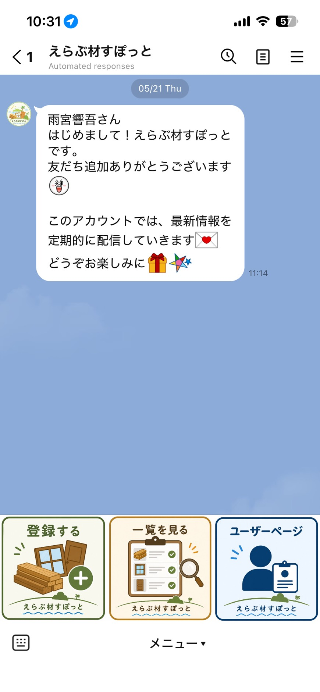

## はじめて使うとき

最初にユーザー情報を登録します。この登録が終わると、材や解体物件を登録できるようになります。

1. リッチメニューの「ユーザーページ」を押します。
2. 利用情報の準備が終わるまで待ちます。
3. 「プロフィール」タブで次の必須項目を入力します。
   - 名前
   - 拠点住所（町名、現場名など）
   - 運搬情報（軽トラで運搬可能、引き取りのみ、など）
4. 必要に応じて、事業者名、ユーザー区分、主なエリアを選びます。
5. 必要に応じて「相手に送るあなたの連絡先」を入力します。
6. 画面下部の「登録する」または「更新する」を押します。

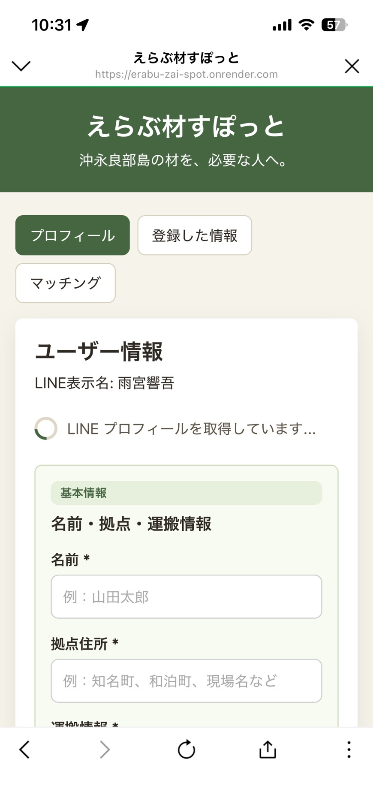

### 連絡先共有カードについて

共有用の表示名、連絡方法、連絡先、連絡しやすい時間帯、ひとことを登録できます。

登録しただけでは相手に公開されません。マイページの「問い合わせ」タブから「自分の連絡先を送る」を押し、相手と内容を確認して送ります。未登録の場合はその場で入力できます。保存だけでは送信されません。

## 登録情報を見る

1. リッチメニューの「一覧を見る」を押します。
2. 画面上部のボタンで表示を絞り込みます。
   - すべて
   - 材があります
   - 探しています
   - 解体物件
3. 「木材」「建具」「金物」などの種類でも絞り込めます。種類のボタンは横にスクロールできます。
4. 気になるカードの「詳細を見る」を押します。

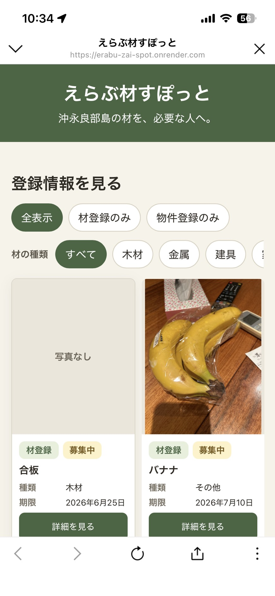

一覧には、提供できる材、探している材、解体物件が同じ画面に表示されます。緑・オレンジ・青のラベルで見分けられます。

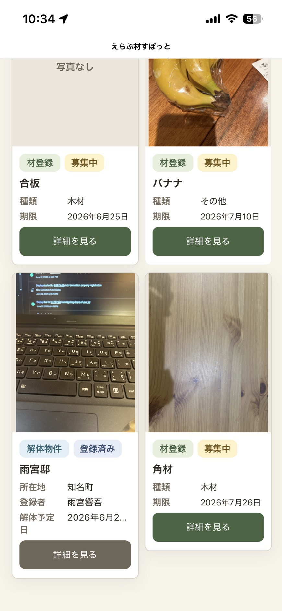

## 「材があります」へ問い合わせる

1. 材の「詳細を見る」を押します。
2. 写真、材種、量の目安、エリア、任意の詳しい情報を確認します。
3. 希望する場合は「問い合わせる」を押します。
4. 問い合わせがマッチング履歴に保存され、登録者へLINE通知が送られます。
5. マイページの「問い合わせ」タブで、その後の連絡や状況を確認します。

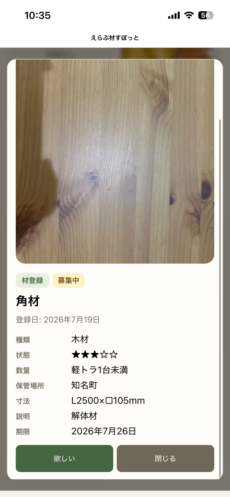

> 自分が登録した材には希望を送れません。同じ材への連続送信も制限されています。

## 「探しています」へ提供を申し出る

1. 「探しています」の投稿を開きます。
2. 探している材種、内容、希望数量・寸法・エリアなどを確認します。
3. 提供できそうな材がある場合は「提供できます」を押します。
4. 申し出がマッチング履歴に保存され、投稿者へLINE通知が送られます。
5. 連絡先は、マイページで共有した場合だけ相手へ送られます。

## 解体物件を見学したいとき

1. 解体物件の「詳細を見る」を押します。
2. 所在地、解体予定日、見学期間、構造、状態評価、備考などを確認します。
3. 希望する場合は「見学したい」を押します。
4. 見学希望がマッチング履歴に保存され、登録者へLINE通知が送られます。

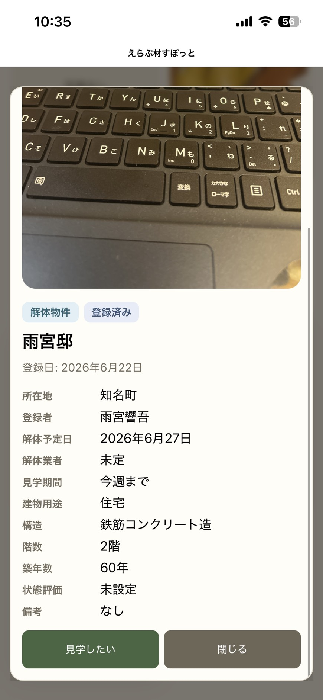

> 所有者や管理者の許可なく、物件へ立ち入らないでください。見学日時や安全上の注意は、登録者と確認してから訪問してください。

## 材・募集・解体物件を投稿する

リッチメニューの「登録する」を押し、「材があります」または「材を探しています」を選びます。解体予定物件は画面下部の専用ボタンから登録できます。

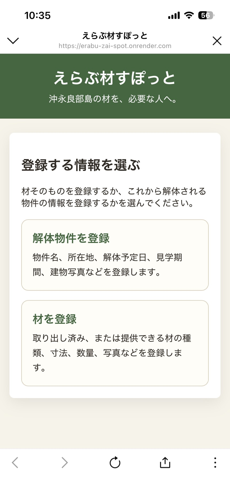

### 「材があります」を投稿する

取り出し済み、または提供できる材を登録します。

1. 「材があります」を押します。
2. 写真を1〜6枚選びます。
3. 材の種類、量の目安、受け渡しエリアを選びます。
4. 必要な場合だけ「詳しい情報を追加する」を開き、寸法、数量、状態、コメントを入力します。
5. 「この内容で投稿する」を押します。

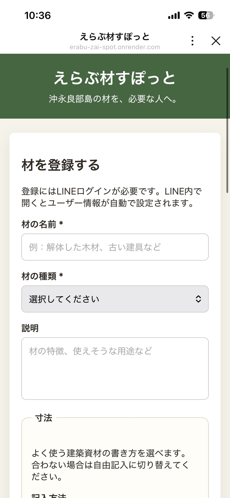

寸法や正確な本数が分からなくても投稿できます。写真は現在の状態が伝わるものを選んでください。

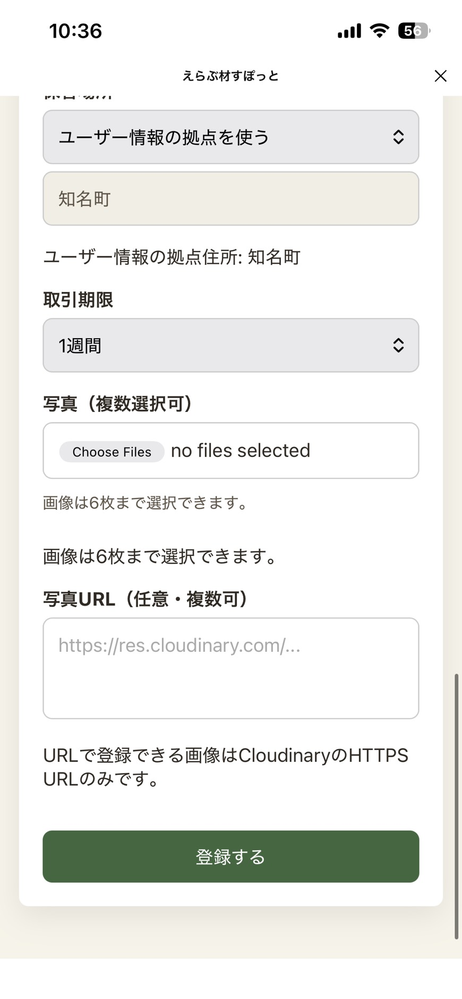

### 「材を探しています」を投稿する

1. 「材を探しています」を押します。
2. 探している材の種類と、欲しい内容を入力します。
3. 必要に応じて希望エリア、希望数量・寸法、使用目的、参考写真を追加します。
4. 「この内容で投稿する」を押します。

参考写真は任意で、6枚まで添付できます。

### 解体物件を登録する

これから解体される建物の情報を登録します。

1. 「解体物件を登録」を押します。
2. 必須項目を入力します。
   - 登録者の立場
   - 物件名
   - 所在地
3. 分かる範囲で、所有者、解体予定日、解体業者、見学期間、用途、構造、階数、築年数を入力します。
4. 必要に応じて建物写真を6枚まで選びます。
5. 再利用できそうな箇所、劣化や雨漏り、立ち入り条件などを「状態評価」「備考」に入力します。
6. 「解体物件を登録する」を押します。

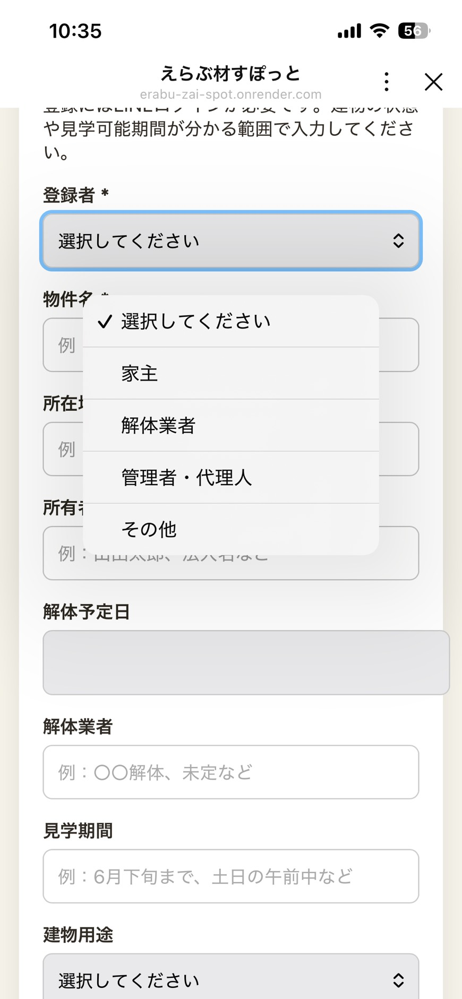

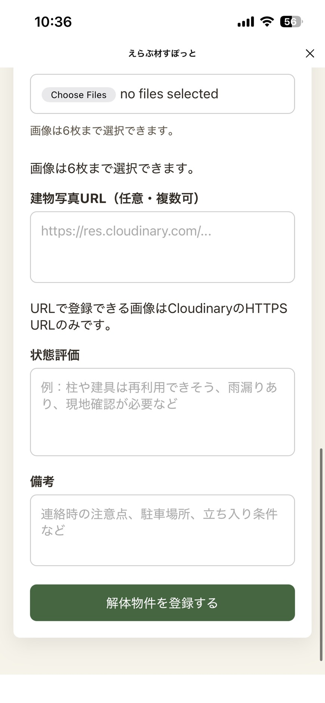

## マイページで管理する

マイページには3つのタブがあります。

### プロフィール

ユーザー情報と連絡先共有カードを確認・更新できます。拠点住所を変更すると、その後の材登録で新しい住所を選べます。すでに登録済みの材の保管場所は自動では変わりません。

### 自分の投稿

自分が登録した材と解体物件を確認できます。

- 「編集する」から内容や写真を更新できます。
- 提供が終わった場合は「譲渡済み・終了」、材が見つかった場合は「見つかりました・終了」を押します。
- 終了または期限切れになった投稿は「30日間再掲載する」で再開できます。
- 「削除する」を押すと確認画面が表示されます。
- 削除した登録は元に戻せません。

### 問い合わせ

自分が送った希望と、自分の登録に届いた希望を確認できます。

1. 届いた問い合わせの内容を確認します。
2. 「自分の連絡先を送る」から入力・確認して、相手に送ります。
3. 相手から届いた連絡先は、同じ問い合わせ内に表示されます。その連絡先で引き取り・見学を相談します。公式アカウントのLINEはお知らせ用です。
4. 受け渡し・見学が終わったら「受け渡しが終わったら」「見学が終わったら」を開き、完了を伝えます。取引しない場合は「今回は見送る」から伝えます。

自分の送信状況と相手からの連絡先の受信状況は自動で表示されます。状態を選んで更新する必要はありません。完了・見送りは相手にLINE通知され、過去の問い合わせにまとまります。

投稿者が受け渡し完了を伝える際は、ほかの問い合わせを引き続き受け付けるか、掲載を終了するか選べます。

## 困ったとき

### LINEプロフィールを取得できない

LINEログインを使用する場合は、アプリ画面を閉じ、LINEの公式アカウントから開き直してください。LINEログインなしでも、ゲスト利用としてユーザー情報を登録できます。

### 「先にマイページで登録してください」と表示される

マイページの「プロフィール」で、名前・拠点住所・運搬情報を入力して登録してください。

### 写真を登録できない

- 一度に選べる写真は6枚までです。
- 対応形式はPNG、JPG/JPEG、GIF、WebPです。
- 読み込みに失敗する場合は、写真の枚数を減らして再度お試しください。

### LINE通知の失敗が表示された

希望や状態変更の履歴は保存されています。マイページの「問い合わせ」タブで履歴を確認し、必要に応じて運営者へ連絡してください。

## 安全に利用するために

- 材の状態は写真だけで判断せず、受け取り前に現物を確認してください。
- 運搬方法、積み込み、必要な人員を事前に相談してください。
- 重い材、鋭利な材、劣化した材の取り扱いには十分注意してください。
- 解体物件では、所有者・管理者の指示と立ち入り条件に従ってください。
- 投稿は30日間掲載されます。不要になった場合は削除ではなく、まずマイページから終了してください。
